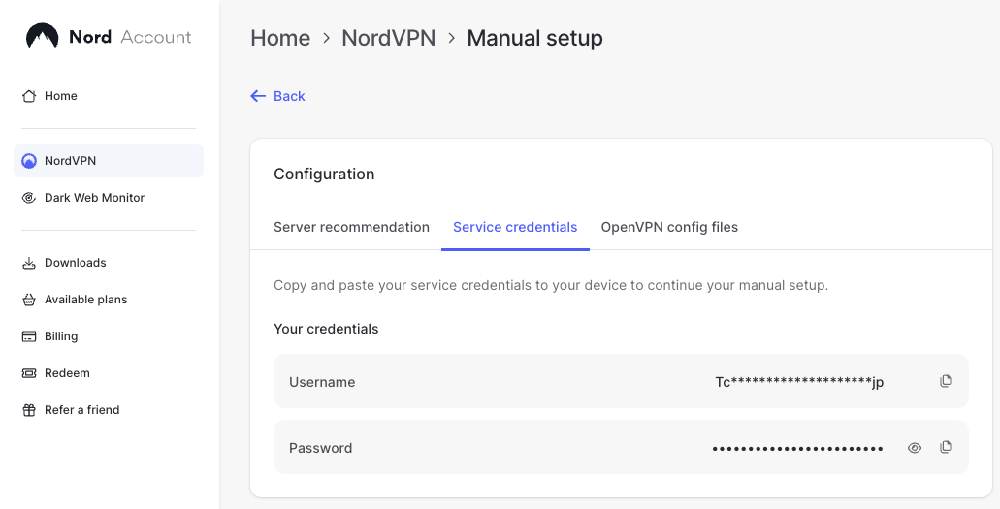

## NordMacPy

This is a tool that lets you automate NordVPN server connections via Python on MacOS.

To use it, you need to have a NordVPN account. You need to get your service credentials user and pass from the dashboard at [my.nordaccount.com](my.nordaccount.com):




Once you have those, the interface is the VpnManager class, which you can use like this:
```python
from nordmacpy import VpnManager
mgr = VpnManager(username=USERNAME, password=PASSWORD)
mgr.connect_to_random_vpn()
```

See `examples/examples.ipynb` for more details.

## Setup

1. **Install OpenVPN**:
   ```bash
   brew install openvpn
   ```

2. **Configure sudo permissions**:
   Add passwordless sudo access (because the package runs these commands to set up the VPN connections) by running:
   ```bash
   sudo visudo
   ```
   
   ...and append the following to the file (replace `YOUR_USERNAME` with your actual username from `whoami` and adjust the openvpn path if needed):
   ```bash
   Cmnd_Alias VPN_OPENVPN = /opt/homebrew/sbin/openvpn
   Cmnd_Alias VPN_CLEANUP = /sbin/route, /usr/bin/pkill, /usr/bin/killall, /usr/bin/dscacheutil
   
   YOUR_USERNAME ALL=(root) NOPASSWD: VPN_OPENVPN, VPN_CLEANUP
   ```

   **Note:** For Intel Macs, use `/usr/local/sbin/openvpn` instead of `/opt/homebrew/sbin/openvpn`.
   
   **Note:** `visudo` uses the `vi` editor. Basic commands:
   - Press `i` to enter insert mode
   - Navigate to the end of the file
   - Paste/type the sudoers entries
   - Press `Esc` to exit insert mode
   - Type `:wq` and press `Enter` to save and quit (or `:q!` to quit without saving)

## Caveats

- This might not work on public wifi portals.
- This might not work for sending requests to IPv6 endpoints (but it should for IPv4).

